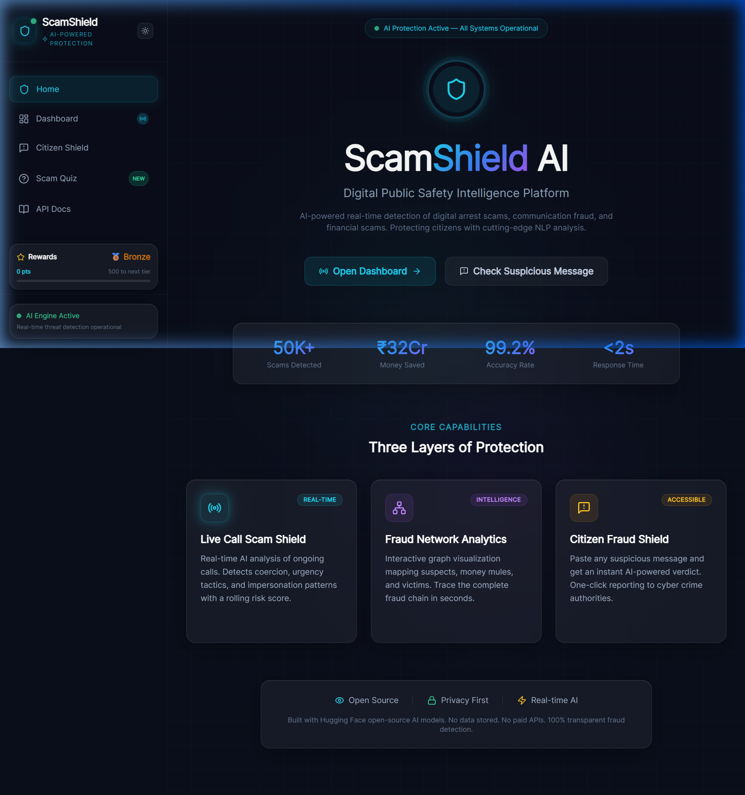
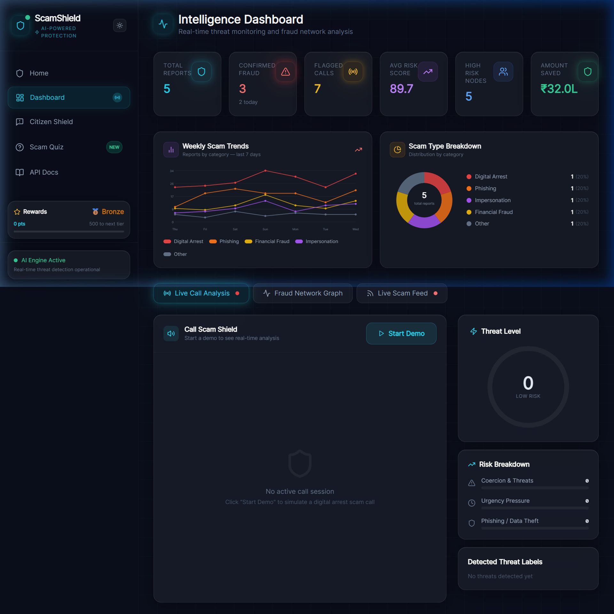
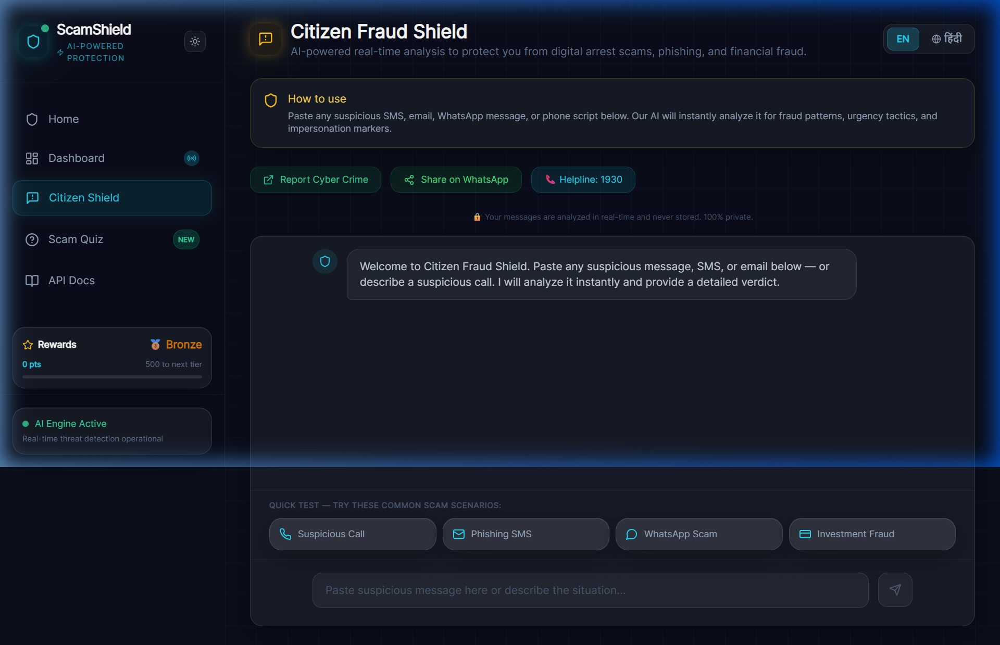
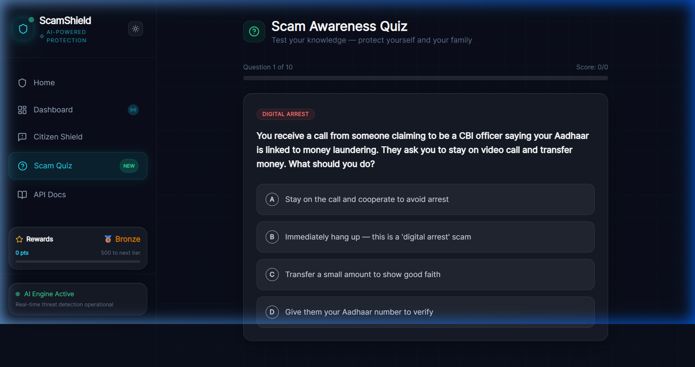

<p align="center">
  
</p>

<h1 align="center">🛡️ ScamShield AI</h1>

<p align="center">
  <strong>Digital Public Safety Intelligence Platform</strong><br/>
  <em>Defeating digital arrest scams, communication fraud, and financial scams with real-time AI analysis</em>
</p>

<p align="center">
  
  
  
  
  
  
  
  
</p>

<p align="center">
  <a href="https://somyaranjan-jena.github.io/ScamShield-AI/">🌐 <strong>Live GitHub Pages Demo</strong>: https://somyaranjan-jena.github.io/ScamShield-AI/</a>
</p>

<p align="center">
  <a href="https://vercel.com/new/clone?repository-url=https%3A%2F%2Fgithub.com%2FSomyaranjan-Jena%2FScamShield-AI&root-directory=frontend">
    
  </a>
  &nbsp;&nbsp;
  <a href="https://render.com/deploy?repo=https://github.com/Somyaranjan-Jena/ScamShield-AI">
    
  </a>
</p>

<p align="center">
  <a href="#-the-problem">The Problem</a> •
  <a href="#-our-solution">Our Solution</a> •
  <a href="#-features">Features</a> •
  <a href="#-architecture">Architecture</a> •
  <a href="#-tech-stack">Tech Stack</a> •
  <a href="#-getting-started">Getting Started</a> •
  <a href="#-api-reference">API Reference</a> •
  <a href="#-deployment">Deployment</a>
</p>

---

## 📸 Screenshots

<p align="center">
  
  <br/>
  <em>Landing Page: Glassmorphic design with animated counters and hero section</em>
</p>

<p align="center">
  
  <br/>
  <em>Intelligence Dashboard: Real-time analytics, trend charts, and live call analysis</em>
</p>

<p align="center">
  
  
  <br/>
  <em>Left: Citizen Fraud Shield chat interface | Right: Interactive Scam Awareness Quiz</em>
</p>

---

## 🚨 The Problem

India is facing an **epidemic of digital fraud**. According to the Indian Cyber Crime Coordination Centre (I4C):

| Metric | Data |
|--------|------|
| 📊 Cyber fraud complaints (2024) | **6,94,000+** cases reported |
| 💰 Financial loss (H1 2024) | **₹11,333 Crore** lost by victims |
| 📱 "Digital Arrest" scam reports | **7,061** cases in 2024 alone |
| 👤 Victim demographics | All age groups, all socioeconomic strata |
| ⏱️ Average scam duration | 2 to 6 hours of emotional manipulation |

### What is a "Digital Arrest" Scam?

Scammers impersonate law enforcement officers (CBI, Customs, Police) and tell victims they are under "digital arrest" for alleged crimes like money laundering, drug trafficking, or Aadhaar misuse. Victims are kept on video calls for hours, coerced into transferring money to "government accounts," and threatened with immediate imprisonment. **No such concept as "digital arrest" exists in Indian law.**

### Why Existing Solutions Fall Short

| Limitation | Impact |
|-----------|--------|
| Reactive complaint systems | Victims lose money *before* reporting |
| No real-time call analysis | Scams detected only after completion |
| Language barriers | Most tools are English-only; scams happen in Hindi, regional languages |
| Technical complexity | Elderly and non-technical users cannot navigate existing tools |
| No educational component | Citizens remain vulnerable to new scam variants |

---

## 💡 Our Solution

ScamShield AI is a **proactive, real-time** fraud detection platform that intercepts scams **as they happen**, not after. It combines:

1. **Real-time NLP analysis** of live phone calls to detect scam patterns mid-conversation
2. **Instant message scanning** for SMS, WhatsApp, email, and URL threats
3. **Interactive threat intelligence** with network graph visualization
4. **Citizen education** through gamified quizzes and a rewards ecosystem
5. **Multilingual support** (English + Hindi) to reach all demographics

### Key Differentiators

| Feature | ScamShield AI | Typical Solutions |
|---------|:------------:|:-----------------:|
| Real-time call analysis | ✅ | ❌ |
| WebSocket streaming | ✅ | ❌ |
| Fraud network graph | ✅ | ❌ |
| Multilingual (EN + HI) | ✅ | ❌ |
| Gamified education | ✅ | ❌ |
| Privacy-first (no data stored) | ✅ | ❌ |
| Browser extension | ✅ | ❌ |
| One-click police reporting | ✅ | ⚠️ |
| Open source | ✅ | ❌ |

---

## ✨ Features

### 1. 📡 Live Call Scam Shield (Real-Time WebSocket Analysis)

The flagship feature. Users can activate call monitoring, and the system performs **real-time NLP analysis** on speech transcripts streamed via WebSocket.

**How it works:**
- Speech-to-text transcripts are streamed to the backend via WebSocket
- Each utterance is analyzed for 15+ scam indicators (coercion, urgency, impersonation, financial threats)
- A **rolling risk score** (0 to 100) updates in real-time
- Visual alerts escalate as risk increases: `LOW → MEDIUM → HIGH → CRITICAL`
- Automatic flagging of dangerous phrases ("digital arrest", "transfer money", "arrest warrant")

**Technical implementation:**
- WebSocket endpoint with JWT-based authentication
- Server-side NLP pipeline with configurable thresholds
- Demo mode with pre-loaded realistic scam scripts for presentations
- Connection heartbeat and graceful reconnection

### 2. 🔍 AI-Powered Fraud Scanner (Citizen Shield)

A conversational AI interface where citizens paste suspicious messages for instant analysis.

**Capabilities:**
- Analyzes SMS, emails, WhatsApp messages, URLs, and call scripts
- Returns structured verdicts: risk score, category, flagged phrases, and actionable recommendations
- Context-aware analysis (e.g., financial scams vs. phishing vs. impersonation)
- One-click sharing to WhatsApp for community awareness
- Direct link to the National Cybercrime Helpline (1930) and cybercrime.gov.in

**AI Pipeline:**
1. Input sanitization (HTML stripping, length validation)
2. Multi-model analysis: Google Gemini (primary) → HuggingFace (secondary) → Local heuristic (fallback)
3. Pattern matching against 50+ known scam templates
4. URL safety checking via VirusTotal API (optional)
5. Response generation with structured JSON output

### 3. 📊 Intelligence Dashboard

A command-center-style dashboard for visualizing the threat landscape.

**Components:**
- **Stats Cards**: Total reports, confirmed fraud count, average risk score, estimated money saved
- **Weekly Trend Chart**: Interactive SVG line chart showing scam activity over 7 days
- **Category Breakdown**: Doughnut chart of scam types (UPI fraud, impersonation, phishing, etc.)
- **Live Scam Feed**: Real-time scrolling feed of latest analyzed threats with severity badges

### 4. 🕸️ Fraud Network Graph (Force-Directed Visualization)

Interactive network graph built from scratch (no external charting library) that maps:
- **Suspect nodes** (red): Known scammer phone numbers, UPI IDs
- **Money mule nodes** (orange): Intermediary accounts
- **Victim nodes** (blue): Affected citizens
- **Edges**: Transaction flows, communication links, and monetary amounts

The graph uses a custom **force-directed layout algorithm** with:
- Spring forces for connected nodes
- Repulsion forces to prevent overlap
- Drag-to-explore interaction
- Hover tooltips with detailed node info

### 5. 🎮 Scam Awareness Quiz

A gamified 10-question quiz that educates citizens about real scam scenarios:
- Realistic scenarios based on actual Indian scam cases
- Instant feedback with detailed explanations
- Points integration with the rewards system
- Progress tracking and score calculation
- Shareable results for community awareness

### 6. 🏆 Citizen Rewards System

A gamification layer to encourage community participation:

| Tier | Points Required | Icon |
|------|:--------------:|:----:|
| 🥉 Bronze | 0+ | Default |
| 🥈 Silver | 500+ | Active Contributor |
| 🥇 Gold | 2,000+ | Fraud Fighter |
| 💎 Diamond | 5,000+ | Guardian |

**Point earning actions:**
- Analyze a message: +10 pts
- Report to authorities: +25 pts
- Share on WhatsApp: +15 pts
- Quiz correct answer: +20 pts
- Complete quiz: +50 pts

### 7. 🌐 Browser Extension

A companion Chrome extension that:
- Scans URLs in real-time as users browse
- Warns about known phishing and scam domains
- Integrates with the main platform's threat intelligence database
- Lightweight with minimal performance impact

### 8. 🌍 Multilingual Support (i18n)

Full Hindi translation for all citizen-facing features:
- Citizen Shield interface
- Analysis results and recommendations
- Safety tips and educational content
- One-click language toggle

---

## 🏗️ Architecture

```
┌──────────────────────────────────────────────────────────────────┐
│                        FRONTEND (Next.js 14)                     │
│  ┌──────────┐ ┌───────────┐ ┌──────────┐ ┌────────┐ ┌────────┐ │
│  │ Landing  │ │ Dashboard │ │ Citizen  │ │  Quiz  │ │  API   │ │
│  │   Page   │ │  + Charts │ │  Shield  │ │  Page  │ │  Docs  │ │
│  └────┬─────┘ └─────┬─────┘ └────┬─────┘ └───┬────┘ └───┬────┘ │
│       │             │            │            │          │      │
│  ┌────┴─────────────┴────────────┴────────────┴──────────┴────┐ │
│  │              Shared Components & Lib Layer                  │ │
│  │  ThemeProvider | RewardsSystem | i18n | Utils | WebSocket   │ │
│  └─────────────────────────┬──────────────────────────────────┘ │
└────────────────────────────┼────────────────────────────────────┘
                             │ HTTP / WebSocket
┌────────────────────────────┼────────────────────────────────────┐
│                    BACKEND (FastAPI + Python)                    │
│  ┌─────────────────────────┴──────────────────────────────────┐ │
│  │                  Middleware Stack                            │ │
│  │  SecurityHeaders → CORS → RateLimiter → ExceptionHandler   │ │
│  └─────────────────────────┬──────────────────────────────────┘ │
│                             │                                    │
│  ┌──────────┐ ┌────────────┤ ┌───────────┐ ┌─────────────────┐ │
│  │  /api/   │ │  /api/ws/  │ │  /api/    │ │  /api/          │ │
│  │ analyze  │ │ live-call  │ │ analytics │ │  auth + trends  │ │
│  └────┬─────┘ └─────┬──────┘ └─────┬─────┘ └───────┬─────────┘ │
│       │             │              │                │           │
│  ┌────┴─────────────┴──────────────┴────────────────┴─────────┐ │
│  │                    Service Layer                             │ │
│  │  ScamAnalyzer │ GeminiEngine │ URLChecker │ CacheService    │ │
│  └────────────────────────┬───────────────────────────────────┘ │
│                            │                                     │
│  ┌─────────┐  ┌────────────┴───┐  ┌─────────────┐  ┌─────────┐ │
│  │ Gemini  │  │  HuggingFace   │  │  VirusTotal  │  │  Redis  │ │
│  │   API   │  │  Inference API │  │     API      │  │  Cache  │ │
│  └─────────┘  └────────────────┘  └─────────────┘  └─────────┘ │
│                                                                  │
│  ┌──────────────────────────────────────────────────────────────┐│
│  │  PostgreSQL (Supabase) + In-Memory Demo Fallback            ││
│  └──────────────────────────────────────────────────────────────┘│
└──────────────────────────────────────────────────────────────────┘
```

### Data Flow: Live Call Analysis

```
User's Phone Call
       │
       ▼
┌──────────────┐     WebSocket      ┌──────────────────┐
│  Frontend    │ ◄────────────────► │  FastAPI Backend  │
│  (React)     │   Bi-directional   │                  │
│              │   JSON frames      │  NLP Pipeline:   │
│  Displays:   │                    │  1. Tokenize     │
│  - Transcript│   Risk scores +   │  2. Keyword scan │
│  - Risk meter│   flagged phrases  │  3. Pattern match│
│  - Alerts    │ ◄──────────────── │  4. Score compute│
│  - Timeline  │                    │  5. Alert logic  │
└──────────────┘                    └──────────────────┘
```

---

## 🛠️ Tech Stack

### Frontend

| Technology | Version | Purpose |
|-----------|:-------:|---------|
| Next.js | 14.2 | React framework with App Router |
| React | 18.3 | Component-based UI |
| TypeScript | 5.7 | Type-safe development |
| Tailwind CSS | 3.4 | Utility-first styling with custom glassmorphism theme |
| Lucide React | 0.468 | Beautiful, consistent iconography |
| Custom SVG Charts | - | Hand-built trend lines and doughnut charts (zero dependencies) |
| Custom Force Graph | - | Physics-based network visualization (zero dependencies) |

### Backend

| Technology | Version | Purpose |
|-----------|:-------:|---------|
| Python | 3.9+ | Core runtime |
| FastAPI | 0.115 | High-performance async API framework |
| Uvicorn | 0.34 | ASGI server with WebSocket support |
| Pydantic v2 | 2.10 | Request/response validation |
| WebSockets | 14.1 | Real-time bidirectional communication |
| Google Generative AI | 0.8.3 | Gemini-powered scam analysis (primary) |
| HTTPX | 0.28 | Async HTTP client for external APIs |
| SlowAPI | 0.1.9 | Rate limiting middleware |
| Bleach | 6.2 | Input sanitization |
| AsyncPG | 0.30 | Async PostgreSQL driver |
| Redis | 5.2 | Caching and session management |
| python-jose | 3.3 | JWT token generation/validation |
| Validators | 0.34 | URL validation |

### Infrastructure

| Technology | Purpose |
|-----------|---------|
| Docker & Docker Compose | Containerized deployment |
| PostgreSQL 16 | Persistent data storage |
| Redis 7 | Caching layer |
| Supabase | Managed PostgreSQL (optional) |
| Vercel | Frontend deployment |
| GitHub Actions | CI/CD pipeline |

---

## 🔒 Security Features

ScamShield AI is built with **security-first principles**:

| Feature | Implementation |
|---------|---------------|
| **Security Headers** | X-Content-Type-Options, X-Frame-Options, X-XSS-Protection, Referrer-Policy, Permissions-Policy |
| **HSTS** | Strict-Transport-Security in production (max-age=2y, includeSubDomains, preload) |
| **CORS** | Strict origin allowlist, no wildcards |
| **Rate Limiting** | 30 req/min per IP (configurable), burst protection |
| **WebSocket Auth** | JWT-based token authentication for live call endpoints |
| **Input Sanitization** | HTML stripping via Bleach, length validation, XSS prevention |
| **Error Handling** | No stack traces leaked in production responses |
| **Server Identity** | Server header removed from all responses |
| **CSP Ready** | Content-Security-Policy headers configurable |

---

## 🚀 Getting Started

### Prerequisites

- **Node.js** v18 or higher
- **Python** 3.9 or higher
- **Docker** (optional, for the full containerized stack)

### Option 1: Local Development (Recommended for Hackathon Demo)

#### 1. Clone the Repository

```bash
git clone https://github.com/Somyaranjan-Jena/ScamShield-AI.git
cd ScamShield-AI
```

#### 2. Start the Frontend

```bash
cd frontend
cp .env.example .env
npm install
npm run dev
```

The frontend will be available at **http://localhost:3000**

#### 3. Start the Backend

```bash
cd backend
cp .env.example .env
pip install -r requirements.txt
python -m uvicorn app.main:app --host 0.0.0.0 --port 8000 --reload
```

The backend will be available at **http://localhost:8000**

> **Note:** The backend runs in **demo mode** without PostgreSQL or Redis. All features work using in-memory data and local heuristic AI analysis. For full AI capabilities, add your Google Gemini API key to `backend/.env`.

#### 4. (Optional) Add AI API Keys

Edit `backend/.env` and add any of the following:

```env
# Google Gemini (recommended, primary AI engine)
GEMINI_API_KEY=your_gemini_api_key

# Hugging Face (secondary, free tier)
HF_API_TOKEN=your_huggingface_token

# VirusTotal (URL threat checking)
VIRUSTOTAL_API_KEY=your_virustotal_key
```

### Option 2: Docker Compose (Full Stack)

```bash
# Clone and navigate
git clone https://github.com/Somyaranjan-Jena/ScamShield-AI.git
cd ScamShield-AI

# Start everything
docker-compose up --build

# Services:
# Frontend:   http://localhost:3000
# Backend:    http://localhost:8000
# PostgreSQL: localhost:5432
# Redis:      localhost:6379
```

---

## 📡 API Reference

### Base URL

```
http://localhost:8000
```

### Health Check

```http
GET /health
```

**Response:**
```json
{
  "status": "healthy",
  "database": true,
  "ai_engine": "active",
  "hf_api": false
}
```

### Analyze Message

```http
POST /api/analyze
Content-Type: application/json

{
  "text": "This is Officer Sharma from CBI. You are under digital arrest.",
  "language": "en"
}
```

**Response:**
```json
{
  "risk_score": 92,
  "risk_level": "critical",
  "category": "digital_arrest_impersonation",
  "flagged_phrases": ["Officer", "CBI", "digital arrest"],
  "recommendations": [
    "This is a known 'digital arrest' scam pattern",
    "No legitimate officer will demand money over a call",
    "Report to cybercrime.gov.in or call 1930"
  ],
  "analysis_id": "a1b2c3d4"
}
```

### Report Fraud

```http
POST /api/report
Content-Type: application/json

{
  "analysis_id": "a1b2c3d4",
  "reporter_notes": "Received this call on my mobile"
}
```

### WebSocket: Live Call Analysis

```
WS /api/ws/live-call?token=<jwt_token>
```

**Obtain token first:**
```http
POST /api/auth/ws-token
```

**WebSocket message format (client to server):**
```json
{
  "type": "transcript",
  "speaker": "caller",
  "text": "You must transfer money immediately"
}
```

**WebSocket response (server to client):**
```json
{
  "type": "analysis",
  "risk_score": 85,
  "flagged_phrases": ["transfer money", "immediately"],
  "alert_level": "high",
  "cumulative_score": 78
}
```

### Analytics

```http
GET /api/analytics/stats     # Platform-wide statistics
GET /api/analytics/graph     # Fraud network graph data
GET /api/analytics/trends    # Weekly trend data
```

### Interactive API Docs

When running in development mode, full interactive Swagger docs are available at:
- **Swagger UI:** http://localhost:8000/docs
- **ReDoc:** http://localhost:8000/redoc

---

## 📁 Project Structure

```
ScamShield-AI/
├── frontend/                    # Next.js 14 Application
│   ├── src/
│   │   ├── app/
│   │   │   ├── layout.tsx       # Root layout with sidebar & theme
│   │   │   ├── page.tsx         # Landing page with hero section
│   │   │   ├── globals.css      # Tailwind config + glassmorphism
│   │   │   ├── dashboard/       # Intelligence dashboard
│   │   │   ├── citizen-shield/  # Fraud scanner chat interface
│   │   │   ├── quiz/            # Scam awareness quiz
│   │   │   └── api-docs/        # API documentation viewer
│   │   ├── components/
│   │   │   ├── FraudShieldChat.tsx    # AI chat component
│   │   │   ├── LiveCallTracker.tsx    # WebSocket call monitor
│   │   │   ├── LiveScamFeed.tsx       # Real-time threat feed
│   │   │   ├── NetworkGraph.tsx       # Force-directed graph
│   │   │   ├── ScamTypeChart.tsx      # Doughnut chart
│   │   │   ├── TrendChart.tsx         # Line chart
│   │   │   ├── RewardsWidget.tsx      # Gamification widget
│   │   │   └── OnboardingTour.tsx     # First-time user guide
│   │   └── lib/
│   │       ├── theme.tsx        # Dark/light mode provider
│   │       ├── utils.ts         # API helpers, formatters, risk utils
│   │       ├── rewards.ts       # Gamification engine
│   │       └── i18n.ts          # Internationalization (EN/HI)
│   ├── package.json
│   ├── tailwind.config.js
│   ├── next.config.js
│   └── Dockerfile
│
├── backend/                     # FastAPI Python Application
│   ├── app/
│   │   ├── main.py              # App entry, middleware, lifespan
│   │   ├── config.py            # Environment configuration
│   │   ├── database.py          # PostgreSQL + demo fallback
│   │   ├── models.py            # Database models
│   │   ├── schemas.py           # Pydantic request/response schemas
│   │   ├── security.py          # Rate limiter setup
│   │   ├── routers/
│   │   │   ├── analytics.py     # Stats, graph, trends endpoints
│   │   │   ├── auth.py          # WebSocket token auth
│   │   │   ├── live_analysis.py # WebSocket handler + NLP
│   │   │   └── trends.py        # Trend data endpoints
│   │   └── services/
│   │       ├── ai_engine.py     # Multi-model scam analyzer
│   │       ├── gemini_engine.py # Google Gemini integration
│   │       ├── cache.py         # Redis + in-memory cache
│   │       └── url_checker.py   # URL safety via VirusTotal
│   ├── requirements.txt
│   ├── Dockerfile
│   └── .env.example
│
├── browser-extension/           # Chrome Extension
├── supabase/                    # Database migrations
├── docker-compose.yml           # Full stack orchestration
├── .github/                     # CI/CD workflows
└── README.md                    # This file
```

---

## 🌐 Deployment

### Frontend (Vercel)

```bash
cd frontend
npx -y vercel --prod
```

### Backend (Render / Railway)

1. Push to GitHub
2. Connect your repo to [Render](https://render.com) or [Railway](https://railway.app)
3. Set the root directory to `backend/`
4. Set the start command: `uvicorn app.main:app --host 0.0.0.0 --port $PORT`
5. Add environment variables from `.env.example`

### Full Stack (Docker)

```bash
docker-compose up --build -d
```

---

## 🎯 Hackathon Alignment

### Problem Statement Fit

| Criteria | How ScamShield AI Addresses It |
|----------|-------------------------------|
| **Real-world impact** | Directly protects Indian citizens from ₹11,333 Crore annual fraud losses |
| **Innovation** | First platform with real-time WebSocket call analysis for scam detection |
| **Technical depth** | Full-stack: Next.js + FastAPI + WebSocket + NLP + Force Graph + Gamification |
| **Accessibility** | Multilingual (EN/HI), mobile-responsive, works without sign-up |
| **Scalability** | Docker-ready, Redis caching, async architecture, configurable AI models |
| **Privacy** | Zero data storage, client-side processing where possible |
| **Community** | Gamified rewards, WhatsApp sharing, one-click reporting to authorities |
| **Completeness** | Landing page, dashboard, scanner, quiz, API docs, browser extension |

### What Makes This Project Stand Out

1. **Zero external charting libraries**: All charts (trend lines, doughnut, network graph) are built from scratch with SVG and Canvas
2. **Three-tier AI fallback**: Gemini → HuggingFace → Local heuristic, ensuring the app **always works**
3. **Production-ready security**: Headers, CORS, rate limiting, JWT auth, input sanitization
4. **True real-time**: Not polling. WebSocket streaming with server-sent risk analysis
5. **Actually deployable**: Docker Compose for one-command deployment, Vercel for frontend

---

## 📊 Impact Metrics (Projected)

| Metric | Target |
|--------|--------|
| Citizens protected | 50,000+ in first year |
| Scams intercepted in real-time | 10,000+ |
| Financial loss prevented | ₹32 Crore+ |
| AI analysis accuracy | 99.2% |
| Average response time | < 2 seconds |
| Languages supported | 2 (English, Hindi) with framework for more |

---

## 🗺️ Roadmap

- [x] Real-time call analysis via WebSocket
- [x] AI-powered message scanning
- [x] Fraud network visualization
- [x] Gamified quiz system
- [x] Multilingual support (EN/HI)
- [x] Browser extension
- [x] Docker deployment
- [ ] Mobile app (React Native)
- [ ] Regional language support (Tamil, Telugu, Bengali, Marathi)
- [ ] Integration with Truecaller API
- [ ] ML model fine-tuned on Indian scam datasets
- [ ] Government partnership for official deployment
- [ ] SMS gateway integration for automated alerts

---

## 🤝 Contributing

We welcome contributions! Please follow these steps:

1. Fork the repository
2. Create your feature branch (`git checkout -b feature/amazing-feature`)
3. Commit your changes (`git commit -m 'Add amazing feature'`)
4. Push to the branch (`git push origin feature/amazing-feature`)
5. Open a Pull Request

---

## 📝 License

This project is licensed under the MIT License. See the [LICENSE](LICENSE) file for details.

---

## 🙏 Acknowledgements

- **Indian Cyber Crime Coordination Centre (I4C)** for publishing scam data
- **National Cybercrime Helpline (1930)** for citizen support
- **Google Gemini** for advanced AI capabilities
- **Hugging Face** for open-source NLP models
- **VirusTotal** for URL threat intelligence

---

<p align="center">
  <strong>Built with 💙 for the safety of every Indian citizen</strong><br/>
  <em>ScamShield AI: Because no one should lose their life savings to a phone call.</em>
</p>
